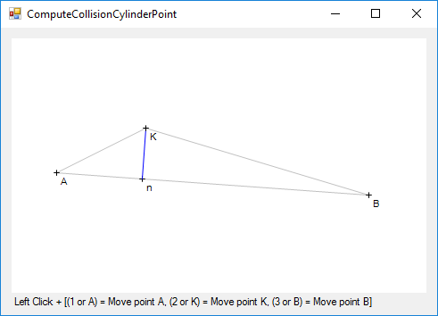

# Overview

This project is a WinForms application (Windows only) to made to visualize and understand the computation of the intersection of a point and a cylinder.

This is a 2D computation, but it can be easily reported to a 3D space.

# How to use

- Press the the `1` key on your numeric pad, the digit key `1` or the key `A` to move the point **A**.
- Press the the `2` key on your numeric pad, the digit key `2` or the key `K` to move the point **K**.
- Press the the `3` key on your numeric pad, the digit key `3` or the key `B` to move the point **B**.

The point **A** represent the center of one of the base of the cylinder, the point **B** represent the center of the other base of the cylinder, and the point **K** represent the a free point in space, of which we want to check for collision with the cylinder.

The point **n** represent the projection of the point **K** along the cylinder axis.

The remaining of the computation, once the point **n** is known, is to check whether the distance **K** to **n** is shorter or longer than the radius of the cylinder.
